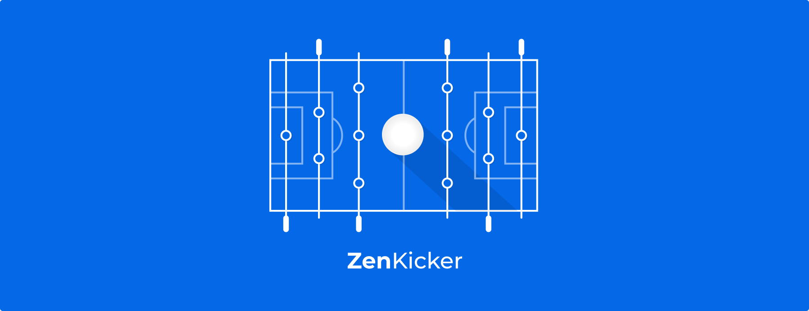

<p align="center">
    <a href="https://github.com/zensoftio/ZenKicker/releases">
        
    </a>
    <a href="https://hub.docker.com/r/zensoftio/kicker">
        
    </a>
    <a href="http://kicker.zensoft.by">
        
    </a>
    <a href="http://kicker.zensoft.by">
        
    </a>
    <a href="https://github.com/zensoftio/ZenKicker/blob/master/LICENSE.txt">
        
    </a>
</p>


## Kicker:  is a table-top game that is loosely based on football

The aim of the game is to use the control knobs moving the ball into the 
opponent’s goal. There are no unified rules for playing the game, in the 
sense which rules vary in different countries and even in the cities, and sometimes 
between different clubs in the same city.

[](http://kicker.zensoft.by)


## For what?

The main idea of this game is to help the team have some rest during working hours 
and to let them have fun in their free time.


## What's there?

In order to make the game more interesting, we’ve included the rating system. 
Team members can register new games, compare their results and compete with each other.


## Running

To build and run the application, you will need Java and Docker preinstalled.

```bash
$ git clone https://github.com/zensoftio/ZenKicker.git
$ cd ZenKicker
$ ./gradlew build
$ docker-compose up
```


## Prerequisites

The **_Kicker application_** uses several environment variables. 
All of them are required to run the application.


### PostgresSQL service

* `POSTGRES_HOST`

Configure the **POSTGRES_HOST** environment variable to point to the host where 
you are running your PostgresSQL server. 
It is required to connect your application to the database.

* `POSTGRES_DB`

Add the name of your PostgreSQL database to the **POSTGRES_DB** environment variable. 
It lets the application know which database it should be connected to.

* `POSTGRES_USER` & `POSTGRES_PASSWORD`

Set the **POSTGRES_USER** environment variable with the username you want to 
use to ensure connection with the database. 
Set the **POSTGRES_PASSWORD** environment variable which is a user's password. 
Using environment variables to add user authentication to your database 
is more secure than to place this configuration in your code. 
**NOTE:** The user you specify in these two environment variables should be a superuser, 
otherwise you will run into problems.


### Frontend

* `SERVER_HOST`

Set the **SERVER_HOST** environment variable so that **Frontend** knows where the requests for the icons should be sent to. 


### Registration

* `DOMAINS`

Set the **DOMAINS** environment variable in order to application can validate login by **_domains of email_** or set ''
(empty string) in order to player can register with any email address.


### Static Data

After the application is started, the static data will be saved in the folder `/data` in the file system.
In case the application is stopped or deployed, the static data will
remain safe.


## Swagger

We’ve used Swagger to enhance your opportunities in frontend and microservices development. 
 
To get Kicker API follow the url:

`http://{host}/swagger-ui.html`